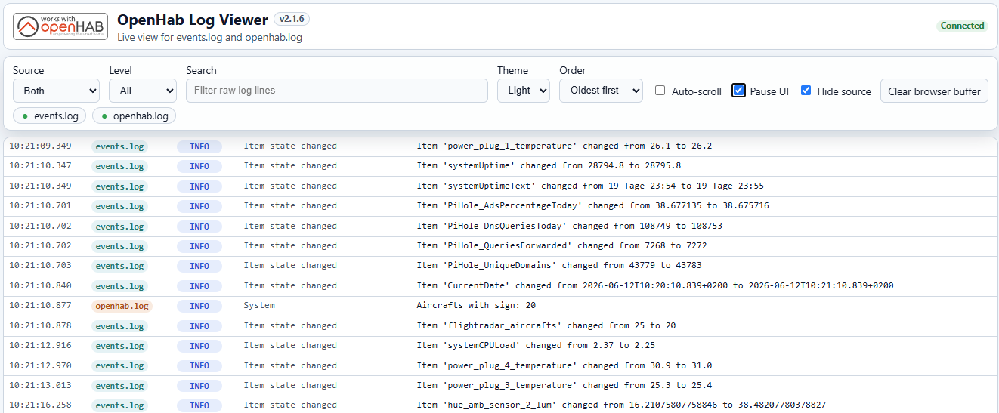

# OpenHab Log Viewer

Live web UI for `events.log` and `openhab.log` built with Node.js, Express, and Server-Sent Events. Every physical log file line stays visible as its own UI row; continuation lines stay grouped under their timestamped parent entry.



## Features

- Initial load of the latest configured lines from `events.log` and `openhab.log`
- Live streaming of new lines via SSE
- Visible per-source file states (`watching`, `missing`, `permission-denied`, `rotated`)
- Browser-side filters for source, level, and text search
- Pause, clear, auto-scroll, and theme switching
- Stored UI preferences that survive a browser reload
- Bounded browser and server buffers

## Configuration

| Variable | Default | Description |
| --- | --- | --- |
| `PORT` | `9001` | HTTP port used by the application |
| `OPENHAB_LOG_DIR` | `/var/log/openhab` | Fallback directory for log files |
| `EVENTS_LOG_PATH` | `/var/log/openhab/events.log` | Full path to `events.log` |
| `OPENHAB_LOG_PATH` | `/var/log/openhab/openhab.log` | Full path to `openhab.log` |
| `INITIAL_LINES_PER_FILE` | `500` | Number of latest lines per file included in bootstrap |
| `MAX_BUFFERED_LINES` | `2000` | Maximum shared server-side ring buffer size |
| `CLIENT_MAX_RENDERED_LINES` | `500` | Maximum number of lines kept in the browser buffer. **Hard-capped at 500**: the browser clamps higher values to 500 to stay responsive under live updates, so the accepted range is `100`–`500`. |
| `MAX_SSE_CLIENTS` | `10` | Maximum number of concurrent SSE stream connections; excess requests receive HTTP 503 |
| `MAX_SSE_CLIENTS_PER_IP` | `3` | Maximum number of concurrent SSE stream connections per client IP; excess requests receive HTTP 503. Prevents a single client from consuming all global slots. |
| `TRUST_PROXY` | `false` | Express `trust proxy` setting. Leave off for direct deployments. Set to the number of proxy hops (e.g. `1`) when running behind a reverse proxy so rate limiting keys on the real client IP. Also accepts `true`, a preset (`loopback`), or a comma-separated list of IPs/subnets. |

`EVENTS_LOG_PATH` and `OPENHAB_LOG_PATH` take precedence over `OPENHAB_LOG_DIR`.

Per-IP limiting keys on the client IP as seen by the app. Behind a reverse proxy, set `TRUST_PROXY` (see [#65](https://github.com/LarsLaskowski/OpenHabLogViewer/issues/65)) so the real client IP is used instead of the proxy's.

When the app runs behind a reverse proxy (Nginx, Caddy, Traefik), set `TRUST_PROXY` so the proxy's `X-Forwarded-For` header is honored. Without it, rate limiting keys every request on the proxy's IP, letting clients exhaust each other's request budget. Keep it **off** for direct deployments, otherwise clients can spoof their IP via `X-Forwarded-For`.

## Development and build

```bash
npm install
npm run build
```

The build creates:

```text
dist/
  client/
  server/
```

Start locally:

```bash
npm run start
```

The application is then available at `http://localhost:9001`.

### Optional client performance instrumentation

For development profiling, enable the browser-side instrumentation with `?perf=1` in the URL or by running `localStorage.setItem('openhab-log-viewer.perf', '1')` in the browser console and then reloading the page.

When enabled, the client records recent bootstrap, filter, render, SSE, reconnect, and visibility-resume measurements in `window.__openhabPerf.snapshot()`. Bootstrap, reconnect, visibility, and slow filter/render/SSE timings are also written to the browser console. Disable it again with `localStorage.removeItem('openhab-log-viewer.perf')` or `?perf=0`.

## Usage

After startup, the application automatically loads the latest configured lines from `events.log` and `openhab.log`, then connects to the live SSE stream.

### UI controls

| Element | Purpose |
| --- | --- |
| `Source` | Filters between both files, only `events.log`, or only `openhab.log` |
| `Level` | Filters by `TRACE`, `DEBUG`, `INFO`, `WARN`, or `ERROR` |
| `Search` | Searches `rawLine` using a case-insensitive substring match |
| `Theme` | Switches between Light and Dark; Light is the default |
| `Order` | Switches between `Newest first` and `Oldest first`; newest-first is the default. In `Oldest first`, the controls panel stays sticky and slightly transparent while scrolling. |
| `Auto-scroll` | Keeps the view pinned to the newest visible edge of the log list |
| `Pause UI` | Stops rerendering in the browser only; data is still received |
| `Clear browser buffer` | Clears the current browser view only; it does not clear the server buffer |

Source, level, search text, theme, order, auto-scroll, and pause state are stored in the browser and restored after a reload.

### Status indicators

- **Connecting / Reconnecting / Connected** show the browser-to-server connection state.
- The **Source status** section shows the current state of each watched file.
- Typical states:
  - `watching`: file is being tailed normally
  - `missing`: file was not found
  - `permission-denied`: file exists but cannot be read
  - `rotated`: log rotation or truncation was detected and the file was reattached
  - `error`: another file-related error occurred

### Log line rendering

- Every physical log file line is rendered as its own visible row.
- Continuation lines stay on their own rows but render under the same log entry with empty metadata columns.
- `events.log` and `openhab.log` remain visually distinct.
- Newest entries are shown at the top by default, but users can switch back to oldest-first ordering.
- Long content wraps instead of causing endless horizontal scrolling.

## Deploy package and copy deployment

Preferred deployment flow:

1. Develop the project externally
2. Run `npm install` and `npm run build`
3. Copy the following artifacts to the target host:

```text
deploy-package/
  dist/
    client/
    server/
  package.json
  package-lock.json
  deploy/
    systemd/
      openhab-log-viewer.service
  README.md
```

Because the server is bundled to `dist/server/index.cjs`, the target host only needs Node.js at runtime.

## systemd installation on Linux

This section is a complete walkthrough for running the viewer as a background service on a Linux host with systemd. It works both for the deploy package described above and for a checkout you built yourself. The bundled unit file `deploy/systemd/openhab-log-viewer.service` assumes the application lives in `/opt/openhab-log-viewer` and runs as the `openhab` user.

### Prerequisites

- A Linux host with **systemd** (the default on Debian, Ubuntu, Raspberry Pi OS, Fedora, etc.).
- **Node.js 20 or newer** installed on the target host. Check with `node --version`. Because the server is bundled into a single `dist/server/index.cjs` file, this is the only runtime dependency — you do **not** need to run `npm install` on the target host.
- The `openhab` user. On a standard openHAB installation it already exists and owns the log files. If it does not exist, create a dedicated service user:

  ```bash
  sudo useradd --system --no-create-home --shell /usr/sbin/nologin openhab
  ```

  If you prefer a different user, change the `User=` line in the service file in step 3.

### 1. Copy the files to the target host

Copy the deploy package (or your built project, including at least `dist/`, `package.json`, and the `deploy/` folder) to the host and place it under `/opt/openhab-log-viewer`:

```bash
# From your build machine
scp -r deploy-package/ user@host:/tmp/openhab-log-viewer

# On the target host
sudo mkdir -p /opt/openhab-log-viewer
sudo cp -r /tmp/openhab-log-viewer/* /opt/openhab-log-viewer/
```

Give the service user ownership of the application directory:

```bash
sudo chown -R openhab:openhab /opt/openhab-log-viewer
```

### 2. Make sure the service user can read the logs

The service user (`openhab` by default) must have **read** access to the files it tails:

```bash
sudo -u openhab head -n1 /var/log/openhab/events.log
sudo -u openhab head -n1 /var/log/openhab/openhab.log
```

If both commands print a line, permissions are fine. On a standard openHAB install the `openhab` user already owns these files. If you run the viewer under a different user, add that user to the group that owns the logs (often `openhab`), for example:

```bash
sudo usermod -aG openhab youruser
```

A `permission-denied` source status in the UI almost always means this step is missing.

### 3. Install and start the service

```bash
sudo cp /opt/openhab-log-viewer/deploy/systemd/openhab-log-viewer.service /etc/systemd/system/
sudo systemctl daemon-reload
sudo systemctl enable --now openhab-log-viewer
```

Check that it is running and follow its log output:

```bash
sudo systemctl status openhab-log-viewer
journalctl -u openhab-log-viewer -f
```

Then open `http://<host-ip>:9001` in a browser. With the default `PORT=9001`, the viewer is reachable on port 9001.

### 4. Configure environment values (optional)

The service file ships with sensible defaults baked in via `Environment=` lines. To override any setting without editing the unit file, create `/etc/default/openhab-log-viewer` — it is read automatically through the `EnvironmentFile=-/etc/default/openhab-log-viewer` directive:

```ini
PORT=9001
EVENTS_LOG_PATH=/var/log/openhab/events.log
OPENHAB_LOG_PATH=/var/log/openhab/openhab.log
INITIAL_LINES_PER_FILE=500
MAX_BUFFERED_LINES=10000
CLIENT_MAX_RENDERED_LINES=500
MAX_SSE_CLIENTS=10
MAX_SSE_CLIENTS_PER_IP=3
# Set to the number of proxy hops when running behind a reverse proxy:
# TRUST_PROXY=1
```

See the [Configuration](#configuration) table for every available variable. Apply changes with:

```bash
sudo systemctl restart openhab-log-viewer
```

### Updating to a new version

Copy the new `dist/` directory over the existing installation, restore ownership, and restart the service:

```bash
sudo cp -r /tmp/openhab-log-viewer/dist/* /opt/openhab-log-viewer/dist/
sudo chown -R openhab:openhab /opt/openhab-log-viewer
sudo systemctl restart openhab-log-viewer
```

### Uninstalling

```bash
sudo systemctl disable --now openhab-log-viewer
sudo rm /etc/systemd/system/openhab-log-viewer.service
sudo systemctl daemon-reload
sudo rm -rf /opt/openhab-log-viewer
# Optional, if you created a dedicated environment file:
sudo rm -f /etc/default/openhab-log-viewer
```

## Operating notes

- The application is intended for home-network use or use behind a reverse proxy.
- Built-in authentication is intentionally not part of the first version.
- If external access is required, add authentication in front of the app via Nginx, Caddy, or Traefik.
