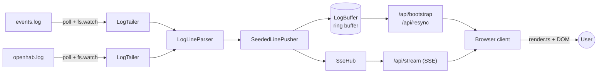

# Architecture

This document describes how OpenHab Log Viewer is put together and, where the
reasoning is recoverable from the code, comments, or issue references, *why*
it looks the way it does. It complements [`README.md`](../README.md) (setup,
configuration, deployment), [`CONTRIBUTING.md`](CONTRIBUTING.md) (workflow),
[`UNIT_TESTS.md`](UNIT_TESTS.md) (test conventions) and [`SECURITY.md`](../SECURITY.md)
(threat model and reporting) rather than repeating them.

Where a design decision is not explained anywhere in the repository, this
document says so explicitly instead of inventing a rationale. Any such gap is
listed in [Undocumented decisions](#undocumented-decisions) at the end; at the
time of writing there are none.

---

## High-level shape

The application is a single Node.js process: a small **Express server** in
`src/server` tails two openHAB log files and serves both a JSON/SSE API and
the built static client; a **framework-free browser client** in `src/client`
renders the combined, filterable log view. There is no separate backend
service, database, or build-time UI framework — the entire app is one
`npm run build` producing `dist/server/index.cjs` (bundled server) and
`dist/client` (bundled static assets), matching the single-process systemd
deployment described in [`README.md`](../README.md#systemd-installation-on-linux).

---

## Server: composition root and request pipeline

**`src/server/index.ts`** is the composition root (`main()`). On startup it:

1. Loads configuration via `loadConfig()` (see [Configuration](#configuration-loading)).
2. Creates one shared `LogBuffer`, one shared `SseHub`, and one shared
   `LogLineParser` — all three are stateful and intentionally shared across
   both log sources rather than instantiated per source, since the buffer and
   the SSE stream must interleave lines from `events.log` and `openhab.log`
   into a single ordered view.
3. Builds a `createSeededLinePusher` (see [Startup seeding](#startup-seeding)).
4. Starts one `LogTailer` per configured source (`events`, `openhab`) and
   awaits `tailer.start()` for both in parallel via `Promise.all`, collecting
   each tailer's initial lines.
5. Feeds the collected initial lines into `linePusher.seedInitialLines()`
   *before* the HTTP server starts listening, so no SSE client can observe a
   half-seeded buffer.
6. Builds the Express `app`: security headers, optional host validation,
   `trust proxy`, `/api` response compression, two rate limiters, the `/api`
   router, and static serving of `dist/client`.
7. Starts listening and wires `createShutdown()` to `SIGINT`/`SIGTERM`.

### Security headers and same-origin policy

`securityHeaders` middleware sets a strict `Content-Security-Policy`
(`default-src 'self'` and equally strict `script-src`/`style-src`/`img-src`/
`connect-src`/`font-src`, `object-src 'none'`, `frame-ancestors 'none'`),
`X-Content-Type-Options: nosniff`, `X-Frame-Options: DENY`, and
`Referrer-Policy: no-referrer`. The code comment on this block explains the
reasoning directly: the client is a single same-origin ES module, styles and
SVG assets are served from the same origin, and bootstrap/resync/stream all
use same-origin `fetch`/`EventSource` — no inline scripts or styles are used,
so no CSP relaxations are required. These headers are defense-in-depth on top
of the client's consistent use of `textContent` (never `innerHTML`) when
rendering attacker-influenced log content.

### Host validation (DNS-rebinding mitigation)

When `ALLOWED_HOSTS` is non-empty, `createHostValidator()`
(`src/server/hostValidation.ts`) is registered as the first middleware and
rejects any request whose `Host` header is not on the allowlist with `403`.
This guards the unauthenticated LAN app against
[DNS rebinding](https://en.wikipedia.org/wiki/DNS_rebinding): a rebinding
request still carries the attacker's `Host`, which is not on the list, while
legitimate access uses a configured hostname. It applies to every route,
including the static client and `/api/stream`. This is explicitly **not
authentication** — it only pins which hostnames the browser may use to reach
the app (see [#132](https://github.com/LarsLaskowski/OpenHabLogViewer/issues/132)).
Unset (the default), the middleware is not registered at all, preserving prior
behavior.

### API response compression

`createApiCompression()` (`src/server/apiCompression.ts`) wraps the
`compression` middleware and is mounted first under `/api`, ahead of the
router. `/api/bootstrap` and reset-mode `/api/resync` responses can run to a
few hundred KB of repetitive JSON (raw line text duplicated across `rawLine`
and `message`, timestamps, logger names), which gzips well; `/api/stream` is
excluded so buffering does not delay live SSE delivery. The exclusion checks
`request.path !== '/api/stream'` using the full mounted path rather than a
router-relative `/stream`, because `compression`'s filter runs lazily on
first write, by which point Express has already restored `request.path` to
the incoming request path (see
[#140](https://github.com/LarsLaskowski/OpenHabLogViewer/issues/140)).

### Rate limiting

Two `express-rate-limit` instances are mounted: `apiLimiter` (200 req/min,
skips `/stream` since that is a long-lived connection, not a request burst)
guards `/api/*`, and `htmlLimiter` (100 req/min) guards the static/HTML
fallback route. Both key on the client IP as seen by Express, which only
honors `X-Forwarded-For` when `trust proxy` is configured — see
[Configuration](#configuration-loading) for why `TRUST_PROXY` defaults to off.

### Fatal startup errors and the CommonJS constraint

`main()` is invoked through a fire-and-forget `run()` wrapper instead of a
top-level `await`. The code comment explains why: the server bundle is
CommonJS (`dist/server/index.cjs`), esbuild rejects top-level `await` in CJS
output, and the deployment shape (systemd unit, release packaging) requires
the `.cjs` entry point. `run()` reports fatal errors itself and calls
`process.exit(1)`; a global `unhandledRejection` handler is a safety net for
anything that still slips through the tailers' own fire-and-forget
`sync()` calls.

---

## Configuration loading

**`src/server/config.ts`** (`loadConfig()`) reads everything from environment
variables with explicit defaults, clamping, and warnings — never silent
failures. Every numeric setting goes through `clampInteger(name, fallback,
min, max)`, which falls back to the default on a non-numeric/non-positive
value and clamps (with a `console.warn`) when the parsed value is out of
range. This keeps a misconfigured deployment running with a safe value
instead of crashing or accepting an unbounded number.

Notable clamps and their stated reasons (from code comments):

- `CLIENT_MAX_RENDERED_LINES` is clamped to `100`–`500` because the browser
  hard-caps rendering at `CLIENT_MAX_RENDERED_LINES_CAP` (500, defined in
  `src/client/state.ts`) for responsiveness; clamping the server-advertised
  value to the same ceiling keeps config, server, and client consistent (see
  [#88](https://github.com/LarsLaskowski/OpenHabLogViewer/issues/88)).
- `POLL_INTERVAL_MS` is clamped to `100`–`5000` so low-volume deployments can
  slow polling to reduce wakeups and high-volume ones can speed it up, while a
  100 ms floor avoids hammering the filesystem (see
  [#43](https://github.com/LarsLaskowski/OpenHabLogViewer/issues/43)).
- `TRUST_PROXY` defaults to `false` (not honoring `X-Forwarded-For`) because
  direct deployments must not trust a spoofable header; it accepts `true`, a
  non-negative integer (hop count), an Express preset (`loopback`, …), or a
  comma-separated IP/subnet list, and is only meaningful when set for a
  deployment that actually sits behind a reverse proxy.
- `HEALTH_DETAILS` defaults to `false` because the detailed `/api/health`
  payload (pid, uptime, per-source state, SSE client counts) leaks host
  details to anyone who can reach the endpoint, e.g. through a reverse proxy.
- `ALLOWED_HOSTS` defaults to empty (validation off) so setting it is a
  deliberate opt-in hardening step, not a breaking default change.

`resolveSourceConfig()` resolves `EVENTS_LOG_PATH`/`OPENHAB_LOG_PATH` (or
`OPENHAB_LOG_DIR` + the fixed file name) to an absolute, `realpathSync`-resolved
path and verifies it currently points at a regular file *if it currently
exists*. A missing file is not an error here — `LogTailer` is designed to
handle a not-yet-created log file gracefully and pick it up once it appears.

---

## Log ingestion pipeline

### `LogTailer` (`src/server/logTailer.ts`)

One `LogTailer` instance per configured source owns everything about reading
one file over time: bootstrap, live tailing, rotation/truncation detection,
and status reporting. It combines two mechanisms rather than relying on
either alone:

- **`fs.watch` on the containing directory** (not the file itself) triggers an
  immediate `sync()` when an event names the watched file. Watching the
  directory instead of the file survives the file being replaced by
  logrotate (a `rename` on the old inode plus a `create` on a new one).
  Events for unrelated files in the same directory (audit logs, `.gz`
  backups) are filtered out by filename.
- **A poll timer** (`POLL_INTERVAL_MS`, default 1000 ms) calls `sync()`
  unconditionally as a fallback, because `fs.watch` is not fully reliable
  across all platforms/filesystems and a dropped or never-established watcher
  must not stop the app from tailing.

`sync()` is guarded against re-entrancy (`syncInFlight`/`syncQueued`): a call
that arrives while a sync is already running is coalesced into a single
follow-up run instead of overlapping reads.

Each `sync()` cycle classifies the file state by comparing the current
`fs.Stats` against what was previously observed:

| Condition | Handling |
| --- | --- |
| File key (`dev:ino`) changed | Treated as **rotation**: offset resets to 0, the partial-line buffer is discarded, status becomes `rotated`. |
| `stat().size < offset` | Treated as **truncation**: same reset as rotation. |
| `size === offset` | No-op; status settles to `watching` if it was not already. |
| `size - offset > MAX_SYNC_DELTA_BYTES` (8 MiB) | Treated like a rotation the tailer cannot afford to fully replay: **skip ahead to the tail** (`skipAheadToTail`) instead of reading the whole delta into memory. Covers a log burst between polls, a backfilled file, or a file replaced in place by a much larger one (same inode, so rotation is not detected by file-key alone). |
| Otherwise | Read exactly the new byte range (`readRange`), decode, and emit completed lines. |

Byte ranges are decoded through a **persistent `StringDecoder`**
(`this.utf8Decoder`) rather than decoding each range independently, so a
multi-byte UTF-8 character split across two sync cycles is not corrupted into
two `U+FFFD` replacement characters. The decoder (and the partial-line buffer)
is reset on every discontinuity — rotation, truncation, reattach, skip-ahead,
or a missing file — because those cases no longer continue the previous byte
stream.

An unterminated line has no upper bound from the OS, so
`MAX_PENDING_CHUNK_CHARS` (1 MiB) force-flushes an over-long pending line as
its own row rather than letting a writer that never emits `\n` (or binary
garbage) grow `pendingChunk` without bound.

**Initial/reattach reads** (`readLastLines`) scan backward from the end of the
file in 64 KiB chunks, counting raw `\n` bytes (safe without decoding, since
`0x0A` never appears as a UTF-8 continuation byte — see
[#66](https://github.com/LarsLaskowski/OpenHabLogViewer/issues/66)) until
`initialLinesPerFile` lines are found or `MAX_TAIL_SCAN_BYTES` (8 MiB) is hit.
Decoding and newline-splitting happens exactly once, after the scan, on the
already-bounded accumulated tail.

**Directory-watch recovery**: if the watcher emits an `'error'` event (the
directory removed/renamed, inotify pressure, `EMFILE`), it is closed and a
retry countdown of `WATCHER_RETRY_POLLS` (30) poll cycles (~30 s at the
default interval) is armed so `tryRestartWatcher()` (called from every
`sync()`'s `finally` block) does not hammer a persistently failing watch,
while the poll loop keeps the tailer functional in the meantime.

**Error mapping** (`handleSyncError`): `ENOENT` resets tailer state and
reports `missing` (the next cycle re-attaches once the file reappears);
`EACCES`/`EPERM` report `permission-denied`; anything else reports a generic
`error` with the OS error code in the message. Status changes are only
emitted when the state or message actually changed (`emitStatus`), so a
healthy tailer does not spam identical `source-status` events every poll.

### `LogLineParser` (`src/server/logLineParser.ts`)

Turns one raw file line into a structured `LogLineDraft`. A line matching
`HEADER_PATTERN` (`YYYY-MM-DD HH:MM:SS.mmm [LEVEL] [logger] - message`) starts
a new group: it gets a fresh `groupId` (`${source}-${n}`, a per-source
monotonic counter) and becomes the new "last header" remembered for that
source. Any other line is a **continuation**: it is still emitted as its own
`LogLineDraft` (never merged into the previous line — this is a binding UI
requirement, see [Key conventions](#key-conventions)), but inherits
`timestamp`/`level`/`logger`/`groupId` from the last header seen for the same
source. A line that is not a header match but does start with a bare
timestamp prefix (`TIMESTAMP_PREFIX_PATTERN`) is *not* treated as a
continuation — `isContinuation` is only true when neither pattern matches,
which distinguishes "an oddly formatted header-like line" from "clearly wraps
the previous entry".

`parseLocalTimestamp` interprets the parsed date/time fields as **local
time** (via the multi-argument `Date` constructor) and normalizes to an
ISO/UTC string, because openHAB writes log timestamps in the host's local
time without a zone offset. This assumes the viewer runs in the same
timezone as the openHAB instance producing the logs — this assumption is
stated directly in the source and is not configurable today.

Per-source state (`lastGroupIdBySource`, `lastHeaderBySource`,
`nextGroupBySource`) lives on the single shared `LogLineParser` instance
created in `index.ts` and is keyed by `LogSource`, so `events` and `openhab`
lines never share group/header context even though they flow through the
same parser object.

### `LogBuffer` (`src/server/logBuffer.ts`)

A fixed-capacity **ring buffer** for recently seen lines, shared across both
sources. `push()` assigns a strictly monotonic `id` starting at 1 (ids are
**not** persisted — they restart at 1 on every server start, which the client
resync logic explicitly accounts for, see
[Client: resync and reconnection](#client-resync-and-reconnection)). Once the
buffer reaches `maxBufferedLines`, the oldest slot is overwritten in place and
the head index advances — insertion and eviction are both O(1). The class doc
notes this replaced an earlier `splice(0, overflow)` implementation that was
O(n) per push. `getItemsAfterId()` computes the start offset directly from
`oldestId` instead of scanning, since ids are contiguous and monotonic within
the buffer, giving O(1) lookup instead of O(n).

### Startup seeding (`src/server/startupSeed.ts`)

`createSeededLinePusher()` exists to solve one ordering problem: a
`LogTailer` can start emitting live lines (from a watcher event or an early
poll) *while the initial bootstrap read for another source is still in
flight*. If those live lines were pushed into the buffer immediately, they
would get **lower ids** than the older bootstrap lines pushed afterwards,
inverting the visible order. Instead, `pushLiveLines()` queues everything
into `preSeedLines` until `seedInitialLines()` runs once (after both tailers'
`start()` calls resolve), at which point the queued live lines are merged
with the bootstrap lines and sorted together by `sortInitialLines()` before
any of them are pushed into the buffer. This one-time merge sort is safe
because no SSE client can be connected yet — the HTTP server only starts
listening after seeding completes.

`sortInitialLines()` sorts by timestamp only (lines from different sources
sharing the same millisecond can interleave — a multi-line group from one
source can be split by a line from the other source during this one-time
bootstrap merge; live tailing afterward preserves strict per-source order). A
line without its own timestamp (a continuation) inherits the last timestamp
seen for its source during the sort, or sorts first if none exists yet. The
sort key is precomputed per line specifically so the comparator is
transitive; a comparator that returns 0 whenever a timestamp is missing would
not be, and `Array.prototype.sort` makes no guarantees for an inconsistent
comparator.

### `SseHub` (`src/server/sseHub.ts`)

Manages all connected `/api/stream` clients and periodic heartbeats (every 15
s by default). Two independent connection caps are enforced before a client
is accepted: a global `maxClients` (`MAX_SSE_CLIENTS`) and a per-IP
`maxClientsPerIp` (`MAX_SSE_CLIENTS_PER_IP`), both returning `503` when
exceeded — the per-IP cap specifically prevents one client from consuming all
global slots.

**Back-pressure**: `writeToAll()` drops any client whose
`response.writableLength` exceeds `MAX_CLIENT_BUFFER_BYTES` (1 MiB) instead of
writing more to it. A slow or stalled consumer that never drains its socket
would otherwise cause Node to buffer broadcast payloads in memory without
bound, growing server heap until the process is OOM-killed under high log
throughput; dropping the client bounds that cost.

**Batching**: `broadcastBatch()` concatenates SSE frames for a whole batch
into a rolling chunk and flushes once the chunk reaches `WRITE_CHUNK_CHARS`
(256 KiB of UTF-16 characters, which tracks bytes closely for log text)
rather than writing the whole batch in one call or one frame per line. This
keeps `MAX_CLIENT_BUFFER_BYTES` acting as a per-cycle floor instead of a
ceiling — a single sync cycle can carry up to `MAX_SYNC_DELTA_BYTES` (8 MiB)
of log — while still collapsing tens of thousands of potential per-line
writes into a few dozen actual `write()` calls.

### API routes (`src/server/routes.ts`)

`createApiRouter()` exposes four endpoints:

- **`GET /api/health`** — `{ status: 'ok' }` by default; the detailed payload
  (pid, uptime, per-source statuses, SSE client counts) is only included when
  `HEALTH_DETAILS=true` (see [Configuration](#configuration-loading)).
- **`GET /api/bootstrap`** — returns up to `serverMaxSyncLines`
  (`min(maxBufferedLines, clientMaxRenderedLines)`) buffered lines, current
  source statuses, effective client-facing config values, and a `SyncCursor`
  describing the buffer's current bounds (`oldestAvailableId`,
  `newestAvailableId`, `lastIncludedId`, `limit`, `totalBufferedLines`,
  `truncated`).
- **`GET /api/resync?afterId=&limit=`** — used by the client after a
  reconnect or a tab visibility change to catch up without a full reload. It
  decides between two response modes purely from arithmetic on buffer ids
  (no scanning), since `LogBuffer` ids are contiguous and strictly monotonic:
  - **`append`**: `afterId` still falls within the buffered range and the
    number of lines after it does not exceed `limit` — returns exactly those
    lines via `LogBuffer.getItemsAfterId()`.
  - **`reset`**: either the cursor is no longer available (`afterId` is ahead
    of the newest buffered id — which happens when the *server* restarted and
    `LogBuffer` ids restarted at 1 while the client still holds a large
    pre-restart id — or `afterId` is behind the oldest buffered id, i.e. the
    gap was evicted) or the number of lines after the cursor exceeds `limit`.
    A full bounded snapshot (`buffer.getItems(limit)`) is returned instead,
    with `resetReason` set to `'cursor-not-available'` or `'limit-exceeded'`
    so the client can log/act on why it reset.
- **`GET /api/stream`** — the SSE endpoint. Rejects with `503` when the
  global or per-IP SSE limit is reached (checked *before* any headers are
  sent); otherwise sends the standard SSE headers
  (`Content-Type: text/event-stream`, `Cache-Control: no-cache, no-transform`,
  `Connection: keep-alive`, `X-Accel-Buffering: no` to disable reverse-proxy
  buffering) and registers the client with `SseHub`.

`parseSyncLimit`/`parseAfterId` validate query parameters strictly (must
parse as a non-negative/positive integer; anything else is a `400`), and the
requested limit is always clamped to `serverMaxSyncLines` server-side — the
client cannot request more lines than the server is configured to hand out
regardless of what it passes.

### Graceful shutdown (`src/server/shutdown.ts`)

`createShutdown()` builds the `SIGINT`/`SIGTERM` handler: stop every tailer,
close the `SseHub` (ending all open SSE connections), then `server.close()`
and exit `0` once it drains. A `setTimeout` guard (`timeoutMs`, default 10 s,
`unref()`'d so it never itself keeps the process alive) force-exits with code
`1` if `server.close()`'s callback never fires — e.g. a lingering keep-alive
connection that never closes on its own. `exit`/`log`/`timeoutMs` are
injectable specifically so this sequencing can be unit-tested without
touching the real `process` object.

---

## Client architecture

The client is deliberately **framework-free**: no React/Vue/etc., no virtual
DOM, no client-side build-time templating beyond esbuild bundling plain
TypeScript. `src/client/entry.ts` is the only module with a side effect
(`init()`) and is the browser bundle's entry point; every other client module
can be imported by tests without triggering bootstrap or opening a real SSE
connection.

- **`src/client/state.ts`** defines the shared client-facing types (mirrored
  by hand from `src/server/types.ts` — see
  [Shared payload types](#shared-payload-types-are-mirrored-not-imported)) and
  `createInitialState()`, the single source of truth for default UI state
  (filters, theme, log order, auto-scroll, pause, the effective client render
  cap). `getEffectiveClientMaxRenderedLines()` enforces the hard browser cap
  (`CLIENT_MAX_RENDERED_LINES_CAP = 500`) regardless of what the server
  advertises, so a misconfigured or malicious server response cannot make the
  browser try to render an unbounded number of rows.
- **`src/client/main.ts`** is the largest module and owns bootstrap, the SSE
  connection lifecycle, resync, preference persistence, and the
  page-visibility handling described below. It is intentionally not split
  further than the extractions already made (`derivedLogView.ts`, `filters.ts`,
  `render.ts`, `preferences.ts`, `dom.ts`, `performance.ts`) — those were
  pulled out specifically because they are DOM-free or otherwise unit-testable
  in isolation, whereas `main.ts` is the orchestration layer that wires them
  to real DOM elements and network calls.
- **`src/client/derivedLogView.ts`** (`DerivedLogView`) maintains the
  filtered-and-ordered view of the buffered lines incrementally: it
  recomputes the filtered set only when the filter key changes
  (`setFilters()`), recomputes the ordered view only when order changes
  (`markOrderDirty()`), and otherwise applies buffered deltas
  (`applyBufferedDelta()`) so a live line append/evict touches only the
  affected end of the already-computed arrays instead of re-filtering the
  whole buffer on every SSE line.
- **`src/client/filters.ts`** is the pure filter-predicate layer
  (`prepareLogFilters`, `matchesPreparedLogFilters`) that `DerivedLogView`
  builds on; it caches each line's lowercased search text in a `WeakMap`
  keyed by the line object so repeated filtering does not re-lowercase the
  same string.
- **`src/client/render.ts`** does all DOM writes. `renderLogLines()` performs
  **keyed reconciliation by line id**: it diffs the desired id list against
  the previously rendered one, reuses existing row nodes where the id is
  unchanged, and only inserts/removes/moves the actual delta (see
  [#44](https://github.com/LarsLaskowski/OpenHabLogViewer/issues/44)). Scroll
  position handling is deferred into a `requestAnimationFrame` callback
  (`scheduleScrollAdjustment`) specifically to avoid the synchronous reflow
  that reading `scrollHeight`/`clientHeight` immediately after a DOM mutation
  would force (see [#45](https://github.com/LarsLaskowski/OpenHabLogViewer/issues/45));
  concurrent renders within one frame coalesce into a single scroll write.
  All text content is set via `textContent`, never `innerHTML` — this is the
  client-side half of the XSS defense referenced in the server's CSP comment.
- **`src/client/preferences.ts`** persists/restores filters, theme, log
  order, auto-scroll, and pause state to `localStorage` behind a minimal
  `PreferenceStorage` interface (so it can be exercised without a real
  `localStorage` in tests). Persisted query text is capped at
  `MAX_STORED_QUERY_LENGTH` (1000 chars) so an extreme value cannot bloat
  storage or hit its quota on its own; `setItem` failures (private browsing,
  quota exceeded) are swallowed with a console warning rather than
  propagating, since persistence is a non-critical convenience.
- **`src/client/dom.ts`** provides `getRequiredElement`/
  `getRequiredTypedElement`, throwing immediately if a control element
  referenced by id is missing or of the wrong type — a fail-fast check at
  module load rather than scattered null checks throughout `main.ts`.
- **`src/client/performance.ts`** is opt-in client-side instrumentation
  (`?perf=1` in the URL, or `localStorage['openhab-log-viewer.perf'] = '1'`).
  When disabled, every method is a no-op (`NOOP_COMPLETE_TIMING`) so the
  instrumentation has effectively zero cost in normal operation. When
  enabled, timings and events are kept in a bounded ring
  (`MAX_RECENT_ENTRIES = 250`) and exposed via `window.__openhabPerf` for
  manual inspection; only entries at or above a per-category threshold
  (`LOG_THRESHOLD_MS`) are also written to the console, to avoid flooding it
  with sub-millisecond noise.

### Client: resync and reconnection

`main.ts` tracks two independent kinds of catch-up:

- **Stream reconnection**: `EventSource` only fires `error` on a closed
  socket, not on a silently stalled one, so a `HEARTBEAT_WATCHDOG_MS` (35 s —
  a little over twice the server's 15 s heartbeat interval) timer is reset on
  every received event; if it fires, the connection is treated as half-open
  and force-reconnected via a fresh `EventSource`.
- **Resync after reconnect/visibility change**: `resyncFromServer()` requests
  `/api/resync?afterId=<lastSeenLineId>` and applies the result through
  `applyResyncPayload()`. In `reset` mode, it does **not** blindly discard the
  client's current buffer: it preserves any locally buffered lines whose id
  falls strictly after the new snapshot's `lastIncludedId` *and* at or below
  `newestAvailableId`, which specifically handles the case where the
  **server itself restarted** (`LogBuffer` ids reset to 1) while the client
  was disconnected — stale pre-restart lines (with ids above any value the
  fresh server could have produced) are dropped, but genuine new lines that
  arrived during the resync race are kept (see
  [#130](https://github.com/LarsLaskowski/OpenHabLogViewer/issues/130), and
  its regression test in `main.test.ts`).
- **In-flight resync line queuing**: a live SSE line that arrives while a
  resync request is outstanding is queued (`queueLiveLineDuringResync`) rather
  than applied immediately, and flushed once the resync result has been
  applied — this avoids a race where a line arrives, gets appended, and is
  then either duplicated or lost depending on how it relates to the resync
  response.

### Client: background-tab behavior

When `document.visibilityState` is `'hidden'`, the client does not render on
every SSE event:

- Log lines are queued (`hiddenTabState.queuedLiveLines`, capped at
  `getHiddenQueuedLineLimit()`) instead of being appended to `state.lines`
  immediately.
- If the tab stays hidden past `VISIBILITY_RESYNC_IDLE_THRESHOLD_MS` (30 s) or
  the queued-line cap is reached, the client gives up on incremental catch-up
  and marks a resync as pending instead
  (`markVisibilityResyncPending`) — cheaper than replaying a large queue once
  the tab becomes visible again.
- On becoming visible again, `resumeAfterVisibilityRestore()` either performs
  a full resync (if one was marked pending, or one was already pending from a
  reconnect) or flushes the queued lines and does a single batched render
  (`resumeFromNormalHide`) — either way, the tab renders **once** for
  everything that happened while hidden rather than replaying every
  individual update.

This exists specifically so a log-heavy deployment does not burn CPU
re-rendering a background browser tab, while still catching the visible tab
up accurately (and boundedly) once the user returns to it.

### Shared payload types are mirrored, not imported

Per the binding project convention (see [Key conventions](#key-conventions)),
`LogLine`, `SourceStatus`, `BootstrapResponse`, `ResyncResponse`, and the
related types are defined independently in `src/server/types.ts` and
`src/client/state.ts` with matching shapes, rather than through a shared
package or path alias. The repository does not state the reason explicitly,
but it follows from the deployment shape: the server bundles to a single CJS
file (`dist/server/index.cjs`) via esbuild with `platform: 'node'`, and the
client bundles to a single ESM file (`dist/client/main.js`) via esbuild with
`platform: 'browser'`, as two independent `build()` calls in
`scripts/build.mjs` — there is no workspace/monorepo package boundary between
them today, so a shared-types module would need its own build/export step for
what is currently two small, rarely-changing type files. Any change to a
shared payload shape must update both files by hand; there is no compiler
check that enforces they stay in sync beyond each side's own `tsc --build`.

---

## Build and deployment

**`scripts/build.mjs`** is the single build entry point (`npm run build`
first runs `npm run typecheck`, i.e. `tsc --build` across
`tsconfig.server.json`/`tsconfig.client.json`/`tsconfig.scripts.json`, then
runs this script). It recreates `dist/` from scratch, bundles the server
(`platform: 'node'`, `format: 'cjs'`, `target: 'node22'`) and the client
(`platform: 'browser'`, `format: 'esm'`, `target: ['chrome120', 'firefox120',
'safari17']`) independently with `esbuild`, rewrites `__APP_VERSION__` in
`index.html` from `package.json`'s `version`, and copies `styles.css` plus the
openHAB SVG assets into `dist/client`. Both bundles include source maps.

Because the server bundles to a single `.cjs` file with all dependencies
inlined, a deployment target only needs a Node.js runtime — `npm install` is
not required on the target host (see
[README.md § Deploy package and copy deployment](../README.md#deploy-package-and-copy-deployment)).
The default and only documented deployment target is **Linux with systemd**
(`deploy/systemd/openhab-log-viewer.service`), rooted at
`/opt/openhab-log-viewer` and running as the `openhab` user, which on a
standard openHAB installation already owns the log files the tailers need to
read.

CI (`.github/workflows/ci.yml`) runs type-check, test, and build across a
Node.js 22/24/26 matrix, a production-dependency audit
(`npm audit --omit=dev --audit-level=high`), and a SonarQube scan (fed
coverage via `npm run coverage:lcov`, skipped for Dependabot PRs since they do
not receive repository secrets). A single `ci-success` job aggregates the
matrix and other jobs into one stable required status check, so branch
protection does not have to track individual matrix job names that change
whenever the Node.js version matrix changes.

---

## Key conventions

These are binding project conventions, also stated in
[`CLAUDE.md`](../CLAUDE.md)/[`AGENTS.md`](../AGENTS.md)/
[`.github/copilot-instructions.md`](../.github/copilot-instructions.md) for AI
coding agents:

- **Every physical log file line stays its own visible UI row.** Continuation
  lines are never merged into the previous line; they render as their own row
  with placeholder metadata cells (see `createLogLineElement` in `render.ts`
  and the continuation handling in `LogLineParser`).
- The frontend stays **framework-free** unless there is a strong technical
  reason to change it.
- Shared payload changes update **both** `src/server/types.ts` and
  `src/client/state.ts` (see
  [Shared payload types](#shared-payload-types-are-mirrored-not-imported)).
- New client-side default state is added to `createInitialState()` in
  `src/client/state.ts`, not scattered across `main.ts`.
- Source differentiation in the UI (which file a line came from) is done
  through badges and status chips, not by styling an entire row differently
  per source.
- File errors, source status, and reconnect state must stay visible in the
  UI at all times.
- The UI must stay responsive under live updates, and client-side limits
  (`CLIENT_MAX_RENDERED_LINES`, its 500-line hard cap) must be preserved.
- Light theme is the default; dark theme remains selectable and persisted.
- Auto-scroll, pause, clear, filtering, and status visibility are core
  features that must be preserved across changes.
- Built-in authentication is intentionally out of scope (see
  [`SECURITY.md`](../SECURITY.md) for the accepted threat model); deployment
  assumes home-network use or an authenticating reverse proxy in front.
- User-facing text, comments, and documentation are written in **English**.
- Existing helpers and patterns are reused before adding new abstractions;
  dependencies are kept minimal (the runtime dependency set is exactly
  `express` and `express-rate-limit`); changes are kept small and targeted
  rather than broad rewrites.

---

## Undocumented decisions

If a future change introduces a decision without a stated reason, add it here
instead of leaving the gap for the next person. There are currently none.
